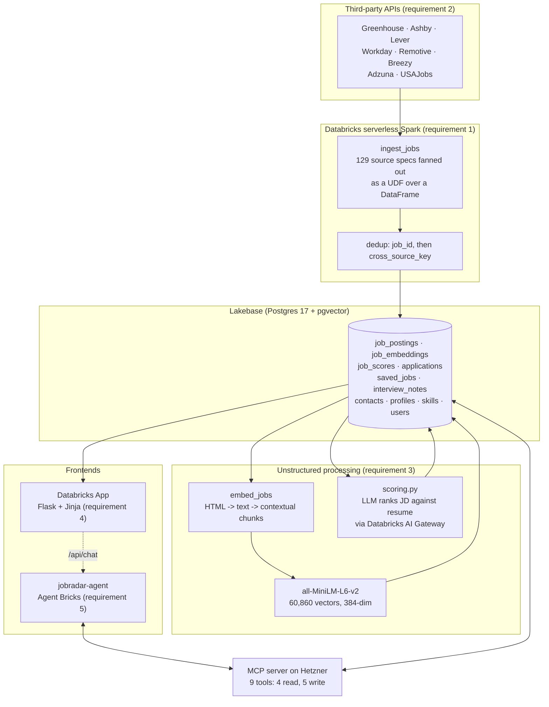

# JobRadar-AI

An AI job hunting copilot. It pulls postings from eight job APIs with Spark,
turns 5,540 job descriptions into 60,860 searchable vectors, ranks them against
a real resume with an LLM, and puts an agent in front of the result that can
both read the database and write to it.

Databricks AI Bootcamp capstone, option 5.

| | |
|---|---|
| **App** | https://jobradar-ai-1352785079224954.aws.databricksapps.com |
| **MCP server** | https://jobradar.lubot.ai/mcp (bearer auth) · [status](https://jobradar.lubot.ai/status) |
| **Repo** | https://github.com/lubobali/JobRadar-AI |
| **Agent** | `jobradar-agent`, Databricks Agent Bricks |
| **Database** | Lakebase (Postgres 17 + pgvector), schema `jobradar`, 10 tables |
| **Tests** | 829 fast, 26 live, ruff clean |

---

## What it actually does

I am job hunting. The problem is not finding job postings, it is that there are
thousands of them and the ones worth my time are buried in the ones that are
not. Keyword search does not help, because the job I want and the job I do not
want use the same words.

So: fetch everything, read every description properly, rank them against my
actual resume, and let me ask questions in English.

```
"Find me remote roles where I'd be building streaming data pipelines"
  -> 10 jobs, ranked, with a reason attached to each score

"Log that I applied to the Sardine one"
  -> Logged as applied, application 2

"What have I applied to so far, and what does the Sardine one actually want?"
  -> the pipeline, plus the full description of a job I applied to
```

That last one is the whole point. The agent reads *and* writes, so the search
results and the application tracker are the same database rather than two
things I have to keep in sync by hand.

---

## Architecture



**Why the MCP server is on my own box and not a Databricks App.** The Databricks
AI Gateway cannot authenticate to a Databricks App. I proved this on the
previous project against every method the connection form offers: DCR (the
workspace OIDC server publishes no `registration_endpoint`), PAT (Apps take
OAuth only and 302 to `/authorize`), OAuth M2M (needs a service principal, which
is admin-only in this workspace), and OAuth U2M (needs a redirect URI on a
Databricks-managed client). So the Databricks App is the **frontend**, and the
MCP server the agent talks to runs on a hardened Hetzner host behind nginx and
Let's Encrypt. Deploy script: [`scripts/deploy_mcp.sh`](scripts/deploy_mcp.sh).

---

## Requirement traceability

Every capstone must satisfy five requirements. Here is exactly where each one
lives and how to check it.

Screenshots of every one of them, with the numbers they produced, are in
[`screenshots/`](screenshots/) — start with its
[index](screenshots/README.md).

| # | Requirement | Where it lives | Evidence it ran |
|---|---|---|---|
| **1** | **Data pipeline in Spark** | [`notebooks/ingest_jobs.py`](notebooks/ingest_jobs.py) — 129 source specs become a DataFrame, a UDF fans out the fetches across executors, results are exploded, deduplicated twice, and written to Lakebase | **5,540 postings** in `job_postings` from 113 of 129 successful fetches |
| **2** | **Third-party API integration** | [`src/jobradar/fetchers/`](src/jobradar/fetchers/) — 8 clients: Greenhouse, Ashby, Lever, Workday, Remotive, Breezy, Adzuna, USAJobs | greenhouse 3,040 · ashby 2,335 · lever 97 · workday 49 · remotive 19 |
| **3** | **Unstructured data processing** | [`src/jobradar/embeddings.py`](src/jobradar/embeddings.py) + [`notebooks/embed_jobs.py`](notebooks/embed_jobs.py) (HTML to contextual chunks to `vector(384)`), and [`src/jobradar/scoring.py`](src/jobradar/scoring.py) (an LLM reading each description against the resume) | **60,860 vectors** covering all 5,540 jobs; **300 LLM-scored**, scores spanning 8 to 92 |
| **4** | **Databricks App with frontend** | [`app/`](app/) — Flask + Jinja. Four tabs: ranked search with filters, Saved, Applied, and **Ask** — a full conversation with the agent, on the same page as the data it is writing to | Live at the App URL above |
| **5** | **AI agent with read and write** | [`mcp_server/jobs_mcp_server.py`](mcp_server/jobs_mcp_server.py) — 9 tools, and [`agent/system_prompt.md`](agent/system_prompt.md) | Transcripts in [`agent/agent_config.md`](agent/agent_config.md); the agent logged application 2 and read it back |

### The agent's eleven tools

| Read | Write |
|---|---|
| `search_jobs(query, top_k, source, remote_only, posted_within_days)` | `save_job(job_id, note)` |
| `get_job(job_id)` | `log_application(job_id, status, note)` |
| `list_applications(status, stale_days)` | `update_application_status(application_id, status)` |
| `get_profile()` | `add_interview_note(application_id, note)` |
| `draft_application_text(job_id, kind)` | `set_follow_up(application_id, follow_up_on)` |
| | `add_contact(company, name, role, notes)` |

`draft_application_text` is a read: it produces the most text of any tool and
stores none of it. The draft belongs to the user, not the database.

### Option 5's own capability list

The capstone's job-hunting option names six things the agent should do. All six
work:

| Capability | Where |
|---|---|
| Search and rank postings against the profile | `search_jobs`, with `fit_score` |
| Explain why a posting is or is not a match | `fit_reason` + `get_profile` |
| Save a posting to a pipeline stage | `save_job`, `log_application`, `update_application_status` |
| Draft a cover-letter snippet or resume bullet | `draft_application_text`, and three buttons on the job page |
| Track interview notes and follow-up dates | `add_interview_note`, `set_follow_up` |
| Surface stale applications | `list_applications(stale_days=...)` |

---

## The parts that were not obvious

Six things in here cost real debugging time. They are documented at the point
of the fix as well, but they are the substance of the project, so they belong up
front.

### 1. The HNSW index was answering out of a pool of 40

`search_jobs(top_k=300)` returned 35 results. The SQL was right, the data was
there, and asking for fewer results returned proportionally fewer.

`hnsw.ef_search` defaults to **40**. It is the size of the candidate list the
index explores, so no query can return more than 40 rows before deduplication no
matter what `LIMIT` says. It is a session variable, and a connection pool hands
out a different session every time, so it has to be set inside the same
transaction as the query:

```python
with lakebase.get_connection() as conn, conn.cursor() as cur:
    cur.execute("SET LOCAL hnsw.ef_search = %s", (EF_SEARCH,))   # 400
    cur.execute(sql, params)
```

The failure mode is quiet: you get results, they are good results, and there are
simply fewer of them than you asked for.

### 2. Deduplication collapsed jobs that were not duplicates

Chunks are deduplicated so one job cannot occupy ten result slots. The first
version deduplicated on `chunk_key` — the chunk's own content hash. Companies
reuse boilerplate ("we are an equal opportunity employer") verbatim across every
posting, so identical chunks from *different jobs* collided and the second job
vanished.

The fix is two `DISTINCT ON` passes in sequence: first `job_id` to pick each
job's best chunk, then `cross_source_key` to collapse the same job listed on
Greenhouse and on Ashby. Dedup on identity, never on content.

### 3. Systemd hardening broke the database, and then the embeddings

`ProtectHome=true` hides `/home`. libpq looks for an *optional* client
certificate at `~/.postgresql/postgresql.crt` on every connection — and a
missing file is fine, while a **permission error is fatal**:

```
could not open certificate file "/home/jobradar/.postgresql/postgresql.crt":
Permission denied
```

Correct URL, correct credentials, works from any shell on the same host, fails
only under systemd. Pointing libpq at paths that genuinely do not exist fixes it
without weakening the sandbox.

The same cause then broke `search_jobs` alone while all eight other tools
worked, which points at the search code rather than at the sandbox:
`HF_HOME` defaults to `~/.cache`, so sentence-transformers could not write the
model it downloads. Both are now set in the unit file, each with the reasoning
next to it.

### 4. Embedding similarity is not job matching

The first ranking put seven Databricks jobs in a top ten. Nothing was broken —
every chunk is prefixed with `"{title} at {company}. {location}."` so that
mid-description chunks are self-identifying, "Databricks" is on my resume, and
cosine similarity did exactly what it is supposed to do.

It is still the wrong answer. Similarity measures *resemblance*, and a job
matching my resume word for word is often the job I am overqualified or
underqualified for. So the vectors became the **retrieval** layer and an LLM
became the **ranking** layer: `scoring.py` sends each description and my resume
to `claude-haiku-4-5` through the Databricks AI Gateway and gets back a score
with a written reason.

The prompt is ported unchanged from `aws-job-streamer`, where it has been
calibrated against months of real applications — including the trap that catches
a pre-sales role dressed in engineering keywords. It works: in the transcript,
a Snowflake "Senior Data Platform Architect" scored **28**, with the reason
*"the core job is customer-facing architecture and deal closure, not hands-on
platform engineering."* Cosine similarity ranked that same job **first**.

The scores span 8 to 92 with a mean of 42, which is the distribution you want.
A scorer that rates everything 70 is not reading.

### 5. The agent wrote a job id that did not exist, and it was my fault

Asked to "save it" in the app's chat page, the agent produced a `job_id` shaped
exactly like a real one, for a job that was not in the database. Postgres
refused it:

```
insert or update on table "saved_jobs" violates foreign key constraint
"saved_jobs_job_id_fkey"
```

The same request worked in the Databricks playground, which is the clue. A
Responses envelope carries the agent's tool **calls** and their **results** as
separate items alongside the message it printed, and the ids live in those
items. The chat page was replaying only the visible text, so by the time the
user said "save it" the agent had its own prose summary and no id anywhere in
context. It produced one shaped like the ids it had seen.

It was not being careless. It had nothing to be careful with. The fix is to
replay the items, so the id it reads is the id the tool returned.

Two things worth keeping:

The **foreign key** is the only reason this surfaced as an error rather than a
saved row pointing at nothing, discovered weeks later. Constraints look like
ceremony right up until they catch something no test would have.

And **trimming** had to change with it. Cutting the history to a flat item
count would drop a tool call while keeping its result, which is a malformed
conversation the endpoint rejects wholesale. The trim now cuts only at a user
message, so every call keeps its result.

### 6. Serverless Spark has no SparkContext

No `sc.parallelize`, no `addPyFile`, so there is no way to ship a zip to the
executors. The fan-out is a UDF over a DataFrame of source specs, and the
package is installed on the cluster with `%pip install git+...` — which is why
this repo is pip-installable at all.

This also forced `SourceSpec` to be a frozen dataclass rather than the closure
the original code used, because a closure cannot be pickled to an executor.

---

## Data model

Schema `jobradar`, 10 tables. `CREATE DATABASE` is refused on Lakebase, so
everything lives in one schema and [`lakebase.py`](src/jobradar/lakebase.py)
pins `search_path` on every connection.

| Table | Holds |
|---|---|
| `job_postings` | one row per deduplicated posting, 15 columns |
| `job_embeddings` | `vector(384)` per chunk, HNSW index with `vector_cosine_ops` |
| `job_scores` | LLM fit score plus its written reason |
| `profiles` / `skills` | the resume the jobs are ranked against |
| `saved_jobs` / `applications` | what I kept and what I sent |
| `interview_notes` / `contacts` | what happened after |
| `users` | multi-user from the start; every read and write is scoped by `user_id` |

Two levels of identity keep duplicates out:
`job_id` is `sha256(source + source_id)` so re-running ingest is idempotent, and
`cross_source_key` is `md5(normalized company + title + location)` so the same
job posted to three boards is one row.

---

## Running it

```bash
git clone https://github.com/lubobali/JobRadar-AI.git
cd JobRadar-AI
python3 -m venv venv && ./venv/bin/pip install -r requirements-dev.txt
./venv/bin/pip install -e .
./venv/bin/python -m pytest -q          # 829 tests, no credentials needed
```

The fast suite mocks every external boundary, so it runs offline in under two
seconds. The 26 `live` tests hit a real Lakebase and skip themselves when
`LAKEBASE_URL` is unset.

**In Databricks:** clone the repo as a Git folder, create a secret scope
`lubo-jobradar` with key `lakebase-url`, then run
`notebooks/ingest_jobs.py` followed by `notebooks/embed_jobs.py`.

**The MCP server:**

```bash
ssh root@<host> 'bash -s' < scripts/deploy_mcp.sh
```

Idempotent. It creates the user, venv, bearer token, systemd unit, nginx vhost
and TLS certificate on the first run, and pulls, reinstalls and restarts on
every run after that. The bearer token is generated on the host and never
printed.

---

## Deliberate deviations

Things I chose not to do, with reasons, so they read as decisions rather than
gaps.

**Drafting runs in the App, not on the MCP host.** It needs a Databricks
identity to reach a Foundation Model. This workspace disables personal access
tokens — *"Tokens are disabled for your organization or you do not have
permissions to use them"* — so the outside host that runs the MCP server cannot
hold one. A Databricks App authenticates natively, so the three Draft buttons on
the job page work. The MCP tool ships anyway, uses the same module and the same
prompt, and reports itself unavailable on a host without credentials rather than
pretending. On a host with them it works unchanged.

This is the third admin restriction in this workspace to shape the architecture,
after no service principals and no dynamic client registration. Each one is
documented where it bites rather than worked around silently.

**Two of the eight APIs returned no data.** Adzuna and USAJobs need API keys I
did not register for, which accounts for 14 of the 16 failed fetches. Both
clients are written and unit-tested; they return nothing without credentials
rather than failing the run. Five sources produced the 5,540 postings, which was
more than enough data to build on, and adding a key later needs no code change.

**Only 300 jobs are LLM-scored, not all 5,540.** Each score is an LLM call
against a full job description. Scoring everything is roughly 18x the cost for a
number I would only ever look at on the top of a ranked list. The 300 are the
top semantic matches for my profile, which is where a score changes a decision.
The agent is explicitly told that a missing score means "not scored yet", not
"scored zero" — a null is absent, not empty.

**Flask and Jinja, not React and Vite.** I build React frontends elsewhere. The
Databricks App here is a data application whose job is to render server-side
state, and putting a build step, a bundler and a second language between the
database and the page would have bought nothing this app needs. The one piece
that genuinely needs interactivity — save, apply, status, notes — is `fetch()`
against JSON endpoints in the same file.

**The ingest notebook is not on a schedule.** It runs on demand. A scheduled job
would have made the numbers in this README move while it was being graded.

**A single user in the database, but multi-user schema throughout.** Every table
carries `user_id` and every query in [`repository.py`](src/jobradar/repository.py)
filters on it. Retrofitting that later means touching every statement, and it
costs nothing to do at the start.

---

## Testing

855 tests, 829 of which need no credentials.

| Area | Tests |
|---|---|
| `fit.py` — ranking and prefilters | 51 |
| `scoring.py` — LLM scoring, both backends | 49 |
| `repository.py` — every SQL statement | 37 |
| MCP tools — all 9, including error paths | 36 |
| the agent relay — envelopes, replay, trimming | 40 |
| `ingest.py` — source specs and dedup | 30 |
| `embeddings.py` — chunking | 27 |
| live Lakebase | 26 |
| everything else | 62 |

Two of these earn their place by not testing behaviour:

`test_collection_guard.py` exists because pytest reports a test it could not
collect as a *warning*, and a warning scrolls past while the suite still says
"passed". Roughly 50 tests were silently dead for two days that way.
`filterwarnings = ["error"]` now makes that fatal.

The other asserts that `repository.py` contains exactly **two** `DELETE`
statements. An agent with write access to a database should not be one
`session.execute` away from a destructive one, and the number is small enough
that changing it should require deliberately editing a test.

---

## Layout

```
src/jobradar/       fetchers, ingest, embeddings, scoring, repository, schema.sql
notebooks/          ingest_jobs.py (req 1), embed_jobs.py (req 3)
mcp_server/         the 9-tool MCP server and its bearer auth
app/                the Databricks App: Flask, Jinja templates
agent/              system_prompt.md, agent_config.md
scripts/            deploy_mcp.sh, seed_profile.py, smoke_test.py
screenshots/        evidence for each requirement, with an index
tests/              855 tests
PLAN.md             the build plan this was written against
```

Portions of `fetchers/`, `scoring.py`, `fit.py` and `prefilter.py` are ported
from [aws-job-streamer](https://github.com/lubobali/aws-job-streamer), my
serverless AWS version of the same idea. The scoring prompt in particular is
calibrated against real applications, which is why the rankings here are usable
rather than merely plausible.

## License

MIT. See [LICENSE](LICENSE).
